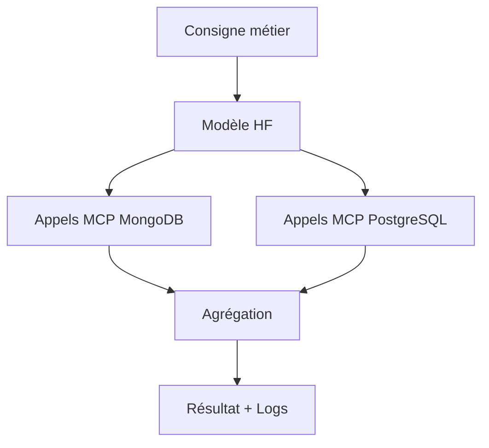

# **Audit automatisé cross-DB piloté par un modèle Hugging Face**
### *Cas d’usage & workflow technique*

**Objectif** :
Un data analyst interagit en français/anglais dans un notebook Jupyter pour obtenir, via une consigne métier, des résultats cross-database (ex: *"Affiche les utilisateurs admins créés cette semaine dans MongoDB et vérifie leur département dans PostgreSQL"*).

---
<!-- slide 2 -->
## **Workflow global**
1. **Traduction** : Le modèle HF custom génère des appels MCP à partir de la consigne métier.
2. **Exécution** :
   - Interrogation de MongoDB via MCP MongoDB.
   - Requête sur PostgreSQL via MCP Postgres.
3. **Résultat** : Agrégation, formatage et affichage dans le notebook, avec logs et explications.

**Avantages** :
- Automatisation des audits, reporting, migration de données.
- Logs reproductibles et intégration IA.

---
<!-- slide 3 -->
## **Prérequis : Infrastructure & Logiciels**
| Élément                | Détails                                                                 |
|------------------------|-------------------------------------------------------------------------|
| **Python**             | ≥ 3.8 (recommandé 3.11+)                                                |
| **Jupyter**            | JupyterLab ou Notebook (`pip install jupyterlab`)                      |
| **Node.js**            | ≥ v14 (pour serveurs MCP MongoDB/PostgreSQL)                           |
| **Docker**             | Optionnel (déploiement rapide des serveurs MCP)                        |
| **Outils système**     | Git, curl/wget, accès admin (ports, variables d’environnement)          |

---
<!-- slide 4 -->
## **Prérequis : Bases de données & Serveurs MCP**
### **Bases de données**
- MongoDB : Instance locale/distante, credentials admin, URI.
- PostgreSQL : Instance locale/distante, credentials admin (host, port, DB, user, password).

### **Serveurs MCP**
- **MongoDB** : `npx @kiliczsh/mcp-mongo-server@latest` ou image Docker.
- **PostgreSQL** : Script Python officiel ou container compatible.
- **Configuration** : Fichier `.mcp.json` avec endpoints, commandes et variables d’environnement.

---
<!-- slide 5 -->
## **Prérequis : Modèle IA Hugging Face**
- **Modèle custom** : Hébergé sur le Hub (public/privé) ou local.
- **Serveur MCP compatible** : API tool-calling (génération, classification, extraction).
- **Sécurité** : `HF_TOKEN` ou clé API configurée (variable d’environnement).

---
<!-- slide 6 -->
## **Prérequis : Librairies Python & Sécurité**
### **Librairies**
- `mcp-client` (ou équivalent) pour les appels MCP.
- Connexion aux DB : `pymongo`, `psycopg2`, `sqlalchemy`.
- Analyse : `pandas`, `seaborn`.
- LLM : `transformers`, `huggingface_hub`.

### **Sécurité**
- Variables d’environnement sécurisées (`.env` ou CLI).
- Ports ouverts pour la communication MCP-notebook.
- Contrôle d’accès réseau/firewall si multi-host/cloud.

---
<!-- slide 7 -->
## **Prérequis : Monitoring & Logs**
- **Outils** : Suivi des appels MCP et logs d’exécution (console, notebook, fichiers).
- **Optionnel** : Dashboard ou visualisation en temps réel des workflows.

---
<!-- slide 8 -->
## **Schéma du workflow**


---
<!-- slide 9 -->
## **Exemple de consigne métier**
```python
# Exemple de requête dans le notebook
consigne = "Affiche les utilisateurs admins créés cette semaine dans MongoDB et vérifie leur département dans PostgreSQL"
resultat = mcp_client.execute(consigne)
display(resultat)
```

---
<!-- slide 10 -->
## **Prochaines étapes ?**
- **Démonstration live** : Exemple concret dans un notebook.
- **Questions/réflexions** :
  - Quels sont vos besoins spécifiques en termes de bases de données ?
  - Avez-vous déjà des serveurs MCP en place ?
  - Souhaitez-vous une intégration avec d’autres outils (ex: Airflow) ?

---
<!-- slide 11 -->
## **Merci !**
**Fabien Furfaro**
*Questions ?*